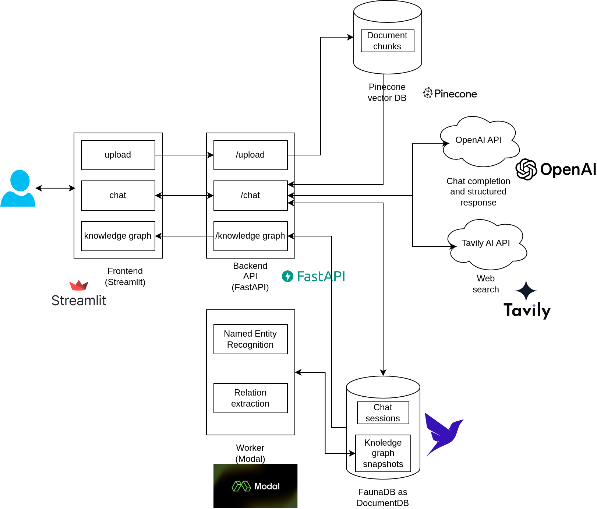

# AIInvestMate
**Your AI powered investment mate**
## Description
AIInvestMate is an AI tool designed to assist you in navigating the complex world of financial products. By analyzing your documents and queries, AI InvestMate diligently reviews new financial offerings, helping you gain a clearer understanding without pushing sales. AIInvestMate is also connected to the internet to gather additional relevant information, enhancing its knowledge database. Through a tailored knowledge graph based on your conversation histories and all retrieved information, AIInvestMate aims to uncover hidden insights and provide sound financial decision-making by providing a structured analysis.

Please note that while AI InvestMate offers valuable insights and assistance in understanding various financial products, it is not intended to be a substitute for professional financial advice.

## Architecture


### Pre-requisites (as per the architecture)
1. OpenAI account and key to be downloaded from https://platform.openai.com/. You need a minimum of $5 to get an API key.
2. Tavily AI account and free API key: https://app.tavily.com/sign-in
3. Pinecone account and free API key: https://login.pinecone.io/
4. FaunaDB account and free API key: https://fauna.com/
5. Modal account: https://modal.com/


### Application set-up
1. Python >=3.11,<3.13, 3.11.5 is recommended
2. Install Python Poetry 1.4.2 following steps mentioned here: https://python-poetry.org/
3. Clone this repo
4. cd to the path where you downloaded the contents
5. Execute the installation script `./install.sh` after giving it execute permissions `chmod +x install.sh`
Make sure that poetry is in your path for the commands to succeed
6. Set up Pinecone index:
- Create an index called `aiinvestmate`
- For dimensions enter 384 and keep metric as cosine
- Keep rest of the settings the default values for the starter plan
- Copy the host and API keys for later
7. Set up FaunaDB collections and indexes:
- Create a database called `aiinvestmate` and create 2 collections called `chat_sessions` and `knowledge_graphs` inside the same
- Create an index called `docs_by_session_id` with the below code in the FaunaDB shell:
```
CreateIndex({
  name: "docs_by_session_id",
  unique: true,
  serialized: true,
  source: "chat_sessions",
  terms: [
    {
      field: ["data", "session_id"]
    }
  ]
})
```
- Create an index called `knowledge_graphs_by_created_on_desc` with the below code in the FaunaDB shell:
```
CreateIndex({
  name: "knowledge_graphs_by_created_on_desc",
  serialized: true,
  source: "knowledge_graphs",
  values: [
    {
      field: ["data", "created_on"],
      reverse: true
    },
    {
      field: ["ref"]
    }
  ]
})
```
8. Set up authentication to Modal using their official steps when you sign in to Modal. The steps are also provided below.
```
pip install modal
python3 -m modal setup
```
<em>The first command will install the Modal client library on your computer, along with its dependencies.

The second command creates an API token by authenticating through your web browser. It will open a new tab, but you can close it when you are done.</em>
9. Create 2 secrets in Modal by following details [here](https://modal.com/docs/guide/secrets): 
- `ai-investmate-faunadb` with the key: `FAUNA_DB_API_KEY` with your Fauna DB key
- `ai-investmate-openai` with the key: `OPENAI_API_KEY` with your OpenAI API key

### Running the application
1. Rename the `.env_template` file to `.env` and add the values for the secrets there without spaces or quotes 
2. `chmod +x run.sh` and `./run.sh` to start the backend and the frontend
3. The app should be available at `http://localhost:8511` using the default settings

### Submit batch job to generate knowledge graph using Modal using all available conversation data
1. `./app/ai-investmate-worker/.venv/bin/modal run src/ai_investmate_worker/main.py`
2. Deploy as CRON job to run once daily: `./app/ai-investmate-worker/.venv/bin/modal deploy --name aiinvestmate-chat-session-insights src/ai_investmate_worker/main.py`
*NOTE:* Since this uses OpenAI models to generate the knowledge graph, you will incur some charges whenever the job runs